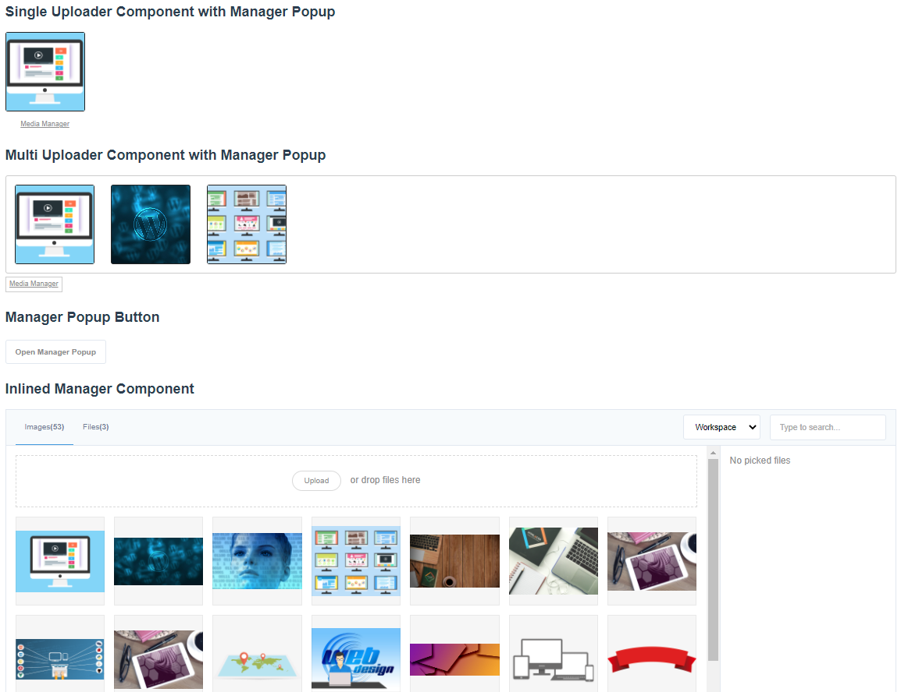

# Vue D-Media

## Introduction

Vue components that can help you to add upload fields and media manager for your project.

Symfony Bundle: [vue-d-media](https://github.com/djvue/vue-d-media)

Usage example: [symfony-d-media-bundle-example](https://github.com/djvue/symfony-d-media-bundle-example)

Usage example demo: [demo](https://d-media.webtm.ru)

Vue components:

- Inline media manager
- Media manager popup
- single upload field
- multi upload field

Opportunities:

- [x] No store/vuex and global store
- [x] Drag and drop files loading to fields and popup
- [x] Click and choose files loading to fields and popup
- [x] Choose media for fields from Media manager
- [x] Constraints to files count, files size
- [x] Can add filters and media relations with config
- [x] Can be used for admin panels and personal cabinets with hidden filters and backend security
to filter medias by user or group or something else
- [x] Api Repository can be easy replaced with another with same interface
- [x] Typescript support



## Installation

```shell
npm install vue-d-media
```

### Webpack global
```js
import Vue from 'vue'
import VueDMedia from 'vue-d-media'

Vue.use(VueDMedia)
```

### Webpack local
```js
import {
  Manager,
  ManagerPopup,
  SingleUploader,
  MultiUploader,
} from 'vue-d-media'

export default {
  components: {
    Manager,
    ManagerPopup,
    SingleUploader,
    MultiUploader,
  }
}
```

Copy dist/vue-d-media.umd.js to you public directory and add script tag
```html
<script src="https://unpkg.com/vue/dist/vue.js"></script>
<script src="https://unpkg.com/vue-i18n/dist/vue-i18n.js"></script>
<script src="/your-path/vue-d-media.umd.js"/>
```

### I18n installation

```shell
npm install vue-i18n
```

```js
import Vue from 'vue'
import VueI18n from 'vue-i18n'

import en from 'vue-d-media/lib/lang/en'
import ru from 'vue-d-media/lib/lang/ru'

const i18n = new VueI18n({
  locale: 'en',
  fallbackLocale: 'en',
  messages: {
    en,
    ru,
  },
})

new Vue({
  ...,
  i18n
}).$mount('#app')
```

See install [example](https://github.com/djvue/symfony-d-media-bundle-example/blob/main/assets/vue-init.js)

See [i18n docs](https://kazupon.github.io/vue-i18n/installation.html)

## Usage

```vue
<template>
<!-- Single Uploader Field -->
<single-uploader v-model="singleMedias" :config="config"></single-uploader>
<!-- Single Uploader Field -->
<multi-uploader v-model="multiMedias" :config="config"></multi-uploader>
<!-- Manager Popup -->
<button @click="$refs.managerPopup.open()">Open Manager Popup</button>
<manager-popup ref="managerPopup" :config="config"></manager-popup>
<!-- Manager Popup Field -->
<manager bordered :config="config"></manager>
</template>
<script>
import 'vue-d-media/dist/vue-d-media.css'
export default {
  data() {
    return {
      singleMedias: [
        // initial media (ignores more than one)
      ],
      multiMedias: [
        // initial medias
      ],
      config: {
        // ...
      }
    }
  }
}
</script>
```

## Properties

### Common properties

- config (Config) [DefaultConfig] - configuration object see type description

### Manager

No parameters required.

Supports `v-model` or `:value` + `@input`.

- `maxFiles` (number) [value from config] - how much files can select

- `canSubmit` (boolean) [false] - can select medias?

- `canUpload` (boolean) [true] - if false upload zone is hidden

- `bordered` (boolean) [false] - add border to manager (for example for inline usage)

- `entities` (Entity[]) [value from config] - filters

- `hiddenEntities` (FilterEntities) [value from config] - hidden filters to send with getList request

- `types` (string[]) [value from config] - active tabs (Images, Files)

### ManagerPopup

No parameters required.

Supports `v-model` or `:value` + `@input`.

`maxFiles` and `types` similar to Manager

### SingleUploader

No parameters required.

Supports `v-model` or `:value` + `@input`.

- `enableManager` (boolean) [true] - add Media Manager button that opens ManagerPopup
- `type` (string) ['images'] - type of uploading media
- `accept` (string) [value from config] - string like '.svg, .jpg, .jpeg, .gif, .png, .webp' with extension/mime type enumerations
- `hiddenEntities` similar to Manager
- `constraints` (string[]) [autogenerated depends on other props] - list of constraints, just for displaying
- `maxFilesize` (number) [value from config] - max uploading file size in MB
- `minWidth` (number) [value from config] - minimum image width in px
- `minHeight` (number) [value from config] - minimum image height in px

### MultiUploader

No parameters required.

Supports `v-model` or `:value` + `@input`.

All props from SingleUploader and:

- `addText` (string) ['ADD'] - add media button text
- `maxFiles` (number) [value from config] - maximum allowed number of files

## Types

See sources [types](types/structures)

## TODO:

- [ ] add laravel backend package
- [ ] add show/hide sidebar button on narrow screens
- [ ] add image resizing provider
- [ ] remove dropzone.js dependency
- [ ] make it work without i18n with saving compatibility
- [ ] add canvas resizing after upload to reduce memory usage
- [ ] add more translations
- [ ] improve docs
- [ ] add unit tests

<!-- ## History --> 
